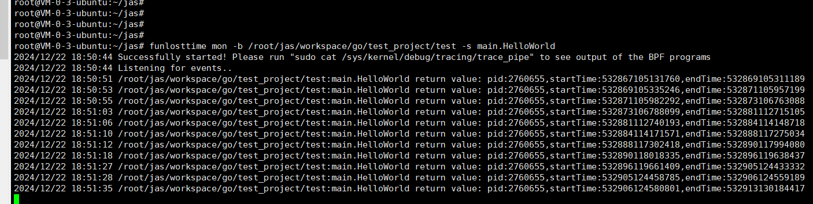

#  统计函数耗时
##  How Use
### clone项目
```
   git  clone  https://github.com/jwcjlu/accumulation.git
```
### 进入相应目录并安装
```
   cd accumulation/framework/ebpf/uprobe/funlosttime
```
```
  go mod tidy
```
```
  go install 
```
### 准备测试项目，并编译
```
package main

import (
        "fmt"
        "time"
        "math/rand"
)

func main() {
        index := 0
        for {
                index++
                time.Sleep(20 * time.Second)
                HelloWorld(fmt.Sprintf("hello world %d", index))
        }

}
func HelloWorld(msg string){
  time.Sleep(time.Duration(rand.Intn(10)) * time.Second)
  fmt.Println(msg)
}

```

### 启动被监控程序

### 启动监控
```
 funlosttime mon -b /root/jas/workspace/go/test_project/test -s main.HelloWorld
其中-b下接监控的执行包，-s下接监控函数的符号（完全路径）
```

